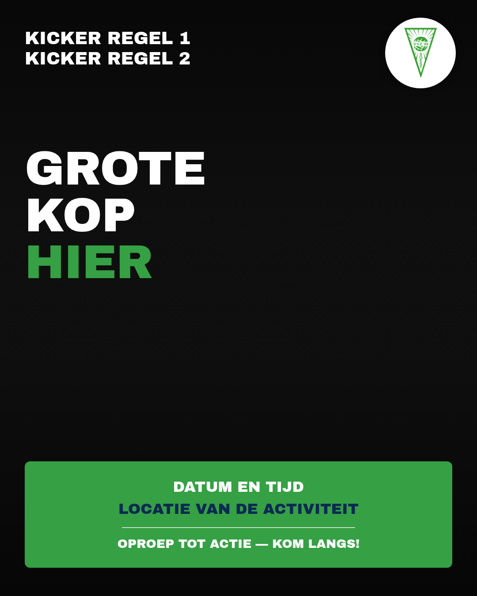

# Huisstijl voor VVZ'49-flyers en -posters

Richtlijnen voor nieuwe posters/flyers van VVZ'49, gebaseerd op een bestaande, herkenbare flyer
van de club (`archief/darttoernooi-lets-play-darts.jpg` — aankondiging van een darttoernooi).
Nieuwe flyers hoeven deze niet letterlijk te kopiëren, maar volgen wel dezelfde opbouw en stijl
zodat club-communicatie herkenbaar blijft.

## Opbouw (van boven naar beneden)

1. **Kicker** — linksboven, 1-2 korte regels, wit, vetgedrukt, in hoofdletters. Kondigt kort aan
   wat voor soort activiteit het is (bv. "DARTTOERNOOI OP DE VOETBALCLUB!").
2. **Logo** — rechtsboven, altijd het VVZ'49-logo op een wit rond vlak, zodat het logo op elke
   (donkere of drukke) achtergrondfoto goed leesbaar blijft.
3. **Grote kop** — het grootste element op de flyer, 2-4 regels, in hoofdletters, meestal een
   pakkende titel of slogan. Eén regel of woord (meestal het laatste, het "kernwoord" van de
   activiteit) staat in het VVZ-groen, de rest in wit.
4. **Achtergrondfoto** — een sfeer- of actiefoto die bij de activiteit past, vol-op-de-pagina
   ("full bleed"), met een donkere overlay zodat de witte tekst er bovenop leesbaar blijft. Kies
   bij voorkeur een foto met genoeg contrast en niet te veel drukte in de bovenhoek (waar de
   kicker en het logo staan) en de onderhoek (waar de infobox staat).
5. **Infobox** — een groen vlak onderaan met afgeronde hoeken, met daarin (allemaal gecentreerd):
   - Datum en tijd(en), vetgedrukt wit
   - Locatie, vetgedrukt in het navy-donkerblauw (voor visuele afwisseling met de rest)
   - Een dunne witte streep als scheiding
   - Een korte oproep-tot-actie ("Kom langs!", "Geef je op!", "Meld je aan via...")

## Kleuren

Dezelfde kernkleuren als de rest van de SWV Soest/VVZ'49-huisstijl (zie ook
`thewally/swvsoest-huisstijl`, waar deze tokens vandaan komen):

| Kleur | Hex | Gebruik op flyers |
|---|---|---|
| VVZ-groen | `#35A044` | Infobox-achtergrond, accentwoord in de grote kop |
| Navy | `#0B2A52` | Locatieregel in de infobox (donkere tekst op het groen) |
| Wit | `#FFFFFF` | Kicker, grote kop (niet-accent), datum/tijd, logo-achtergrond |

Gebruik geen andere kleuren voor tekst/vlakken — dat verwatert de herkenbaarheid.

## Typografie

- **Archivo Black** voor alle koppen, labels en de infobox — precies dezelfde vette,
  brede hoofdletter-stijl als op de originele flyer.
- **Archivo** (variabel gewicht) is beschikbaar voor eventuele kleinere lopende tekst, mocht een
  flyer die nodig hebben (de originele flyer gebruikt die niet — alles staat in Archivo Black).
- Alle koptekst en labels in **hoofdletters**.

*Let op:* de originele darttoernooi-flyer is met een ander (niet exact te achterhalen) vet
schreefloos lettertype gemaakt. Voor nieuwe flyers is bewust gekozen voor **Archivo Black**, omdat
dat al het officiële kop-lettertype van de club/SWV Soest-huisstijl is (zie
`thewally/swvsoest-huisstijl/docs/merkboek.md`) — dat houdt alle club-uitingen (website + flyers)
visueel consistent, ook al wijkt het net iets af van deze ene oudere flyer.

## Logo

- Altijd het officiële VVZ'49-logo (`assets/logos/vvz49.png` of `vvz49-wit.svg`), nooit
  uitgerekt of van kleur veranderd.
- Op een foto-achtergrond: altijd op een effen wit (of transparant genoeg) vlak plaatsen, nooit
  los op de foto — anders valt het logo op donkere/drukke plekken weg.

## Formaat

Template-canvas is **1080 × 1350 px** (beeldverhouding 4:5) — een formaat dat goed werkt voor
zowel WhatsApp/social media als een eenvoudige printuitdraai. Voor een ander formaat (bv. A4
staand voor prikbord-printen): pas `width`/`height` in `templates/poster-template.html` aan en
schaal de font-sizes naar verhouding mee.

## Nieuwe flyer maken

Zie de Claude Code-skill `vvz49-flyer-maken` (`.claude/skills/vvz49-flyer-maken/SKILL.md`) voor
de stap-voor-stap workflow, of handmatig:

1. Kopieer `templates/poster-template.html` naar `flyers/<naam>.html`.
2. Vervang de kicker-, kop- en infobox-tekst, en het pad naar de achtergrondfoto.
3. Render met `scripts/render-flyer.sh flyers/<naam>.html flyers/<naam>.png`.
4. Bekijk het resultaat, pas zo nodig de tekst/foto aan en render opnieuw.
5. Commit zowel het `.html`-bronbestand als de `.png` in `flyers/`.
